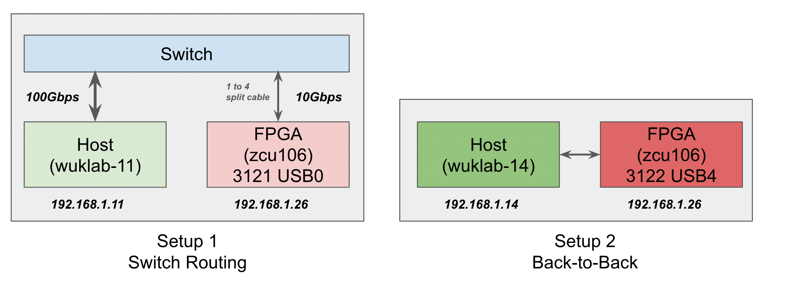

# ASPLOS'22 Artifact Evaluation Instructions

We want to first thank you for evaluating our artifact.

Clio is a complicated system with many moving parts.
The whole compilation and configuration flow involes FPGA,
which is lengthy and error-prone, even to FPGA experts.
To make the evaluation process smoother, we decide to pre-setup the whole system including the host side test program and the FPGA boards. _As an eveluator, you only need to run software scripts on normal servers_.

We recommend you to read [Documentation/compile.md](./compile.md) for repo organization overview.

## Key Results to Reproduce

Our paper has many results ranging from end-to-end microbenchmark, on-board testing, and end-to-end applications.

Except for microbenmarkes, other testings are a bit tricky to setup
and may require evaluators to play around FPGA directly.
Hence we decide to only include microbenchmarks in this "reproduce testing".
Nonetheless, we believe reproducing the scalability, latency, and throughput numbers would be sufficient to prove Clio's design points.

1. Process, PTE, and MR Scalability: paper Figure 4 and Figure 5.
2. End-to-End Throughput: paper Figure 8.
3. Latency: paper Figure 10 Read Latency and Figure 11 Write Latency.

If you'd like to try out the compilation process, please checkout [Documentation/compile.md](./compile.md).

### Testbeds



We prepared two testbeds.
In the 1st setup, all endpoints are connected to a central switch. 
In the 2rd setup, the host and board have back-to-back connection.

The first setup has worse performance mainly because
we used a 1-to-4 split cable to connect the board to the switch.
In our experiments, we found this cable introduced non-trivial latency.
Hence we then prepared the second setup.
Note that if your switch has native 10Gbps support,
you don't need this split cable and would have better performance.

In the second setup, `wuklab-14` has no proper Vivado setup hence only supports performance testing. If you wish to build the FPGA part, you must do so in `wuklab-11`.

### Prepare

Please follow these steps before testing Clio:

1. Use the instructions we posted on HotCRP to login into our server.
    1. See HotCRP comment `@A11`.
    2. For Setup 1, login into `wuklab-11`.
    3. For Setup 2, login into `wuklab-14` (login into wuklab-11 first then ssh into wuklab-14).
2. Once login, we could see three folders. The `artifcats/` folder has the pre-generated FPGA bitstreams and ARM binaries. The `scripts/` folder has bash scripts used to configure FPGA. The `Clio-asplosae/` folder is a freshly cloned Clio repo from Github. You will use this folder only.
```bash
[asplos-ae@wuklab-11]~% pwd
/home/asplos-ae
[asplos-ae@wuklab-11]~% ls -l
total 12
drwxrwxr-x. 4 asplos-ae asplos-ae 4096 Dec  5 01:23 artifacts
drwxr-xr-x. 9 asplos-ae asplos-ae 4096 Dec  4 12:22 Clio-asplosae
drwxrwxr-x. 2 asplos-ae asplos-ae 4096 Dec  2 14:05 scripts
```
3. Switch folder to `Clio-asplosae/host/`. You will run test scripts from here.
```bash
[asplos-ae@wuklab-11 ~]$ cd Clio-asplosae/host/
[asplos-ae@wuklab-11 host]$ pwd
/home/asplos-ae/Clio-asplosae/host
```
4. Test connection to FPGA. The FPGA board can be reached at `192.168.1.26`. Run `arping` to test connection. If `arping` failed, please ping us at HotCRP.
```bash
$ arping -I p4p1 192.168.1.26

ARPING 192.168.1.26 from 192.168.1.11 p4p1
Unicast reply from 192.168.1.26 [DE:AD:00:00:DE:AD]  0.567ms
Unicast reply from 192.168.1.26 [DE:AD:00:00:DE:AD]  0.597ms
```

### Figure 4 (Process Scalability)

This test reproduces paper Figure 4's `Clio-Read` and `Clio-Write` lines.
Since Clio uses connection-less RPC-oriented interfaces,
Clio perfectly scales with the increasing number of connections/processes.

To test, run the following command to invoke the testing script:
```bash
$ ./scripts/test_rw_processes.sh
```

Below is the expected output. The read/write latencies stay flat.
```bash
...
All sessions created, start read/write test..
nr_sessions:    1 avg_Write:  1993.539062 ns Throughput: 64.207420 Mbps
nr_sessions:    8 avg_Write:  1888.851562 ns Throughput: 67.766045 Mbps
nr_sessions:  100 avg_Write:  1881.070312 ns Throughput: 68.046367 Mbps
nr_sessions:  400 avg_Write:  1881.523438 ns Throughput: 68.029979 Mbps
nr_sessions:  700 avg_Write:  1913.484375 ns Throughput: 66.893674 Mbps
nr_sessions: 1000 avg_Write:  1884.867188 ns Throughput: 67.909294 Mbps
nr_sessions:    1 avg_Read:  2082.679688 ns Throughput: 61.459283 Mbps
nr_sessions:    8 avg_Read:  2078.031250 ns Throughput: 61.596764 Mbps
nr_sessions:  100 avg_Read:  2048.820312 ns Throughput: 62.474976 Mbps
nr_sessions:  400 avg_Read:  2005.617188 ns Throughput: 63.820753 Mbps
nr_sessions:  700 avg_Read:  2012.039062 ns Throughput: 63.617055 Mbps
nr_sessions: 1000 avg_Read:  2009.648438 ns Throughput: 63.692732 Mbps
All tests are done.
```

### Figure 5 (Memory Scalability)

This test reprodues paper Figure 5, the memory scalability.
RDMA NIC caches Memory Region (MR) and Page Table Entry (PTE) inside
the on-board cache. RDMA NIC communicates with host DRAM via PCIe.
In contrast, Clio only has PTE.
In addition, the link between on-board SRAM and back-up DRAM is faster than PCIe. As a result, Clio scales better than RDMA.

To test, run the following command to invoke the testing script:
```bash
$ ./scripts/test_rw_pte_mr.sh
```

Below is the expected output:
```bash
...
nr_pte_order:     0 avg_WRITE:  1870.289062
nr_pte_order:     1 avg_WRITE:  1902.945312
nr_pte_order:     7 avg_WRITE:  1939.851562
nr_pte_order:    12 avg_WRITE:  1939.000000
nr_pte_order:    18 avg_WRITE:  1959.398438
nr_pte_order:    22 avg_WRITE:  1970.945312
nr_pte_order:     0 avg_READ:  2018.070312 ns
nr_pte_order:     1 avg_READ:  2049.742188 ns
nr_pte_order:     7 avg_READ:  2171.218750 ns
nr_pte_order:    12 avg_READ:  2157.304688 ns
nr_pte_order:    18 avg_READ:  2151.273438 ns
nr_pte_order:    22 avg_READ:  2153.398438 ns
All tests are done.
```

### Figure 8 (End-to-End Throughput)

This test reprodues paper Figure 8, end-to-end throughput with increasing number of threads.

To test, run the following command to invoke the testing script:
```bash
$ ./scripts/test_rw_threads.sh
```

Below is the expected output.
```bash
...
#nr_theads=  1 Latency read=4685.632812 write=3185.238281 ns. Throughput read=1748.323082 write=2571.864105 Mbps
#nr_theads=  2 Latency read=4718.240234 write=3666.972656 ns. Throughput read=5220.980647 write=7095.573646 Mbps
#nr_theads=  4 Latency read=4861.271484 write=4162.446289 ns. Throughput read=11963.518062 write=15137.270581 Mbps
All tests are done.
```

### Figure 9 and Figure 10 (End-to-End Read/Write Latency)

This test reproduces paper Figure 9 and Figure 10's Clio lines.

To test, run the following command to invoke the testing script:
```bash
$ ./scripts/test_rw_presetup.sh
```

Below is the expected output.
```bash
...
size:     4 avg_WRITE:  1866.296875 ns Throughput: 17.146254 Mbps
size:    64 avg_WRITE:  2279.406250 ns Throughput: 224.619898 Mbps
size:   256 avg_WRITE:  2464.367188 ns Throughput: 831.044988 Mbps
size:  1024 avg_WRITE:  3194.648438 ns Throughput: 2564.288422 Mbps
size:  4096 avg_WRITE: 10318.382812 ns Throughput: 3175.691443 Mbps
size:     4 avg_READ:  2034.742188 ns Throughput: 15.726808 Mbps
size:    64 avg_READ:  2212.593750 ns Throughput: 231.402624 Mbps
size:   256 avg_READ:  2705.500000 ns Throughput: 756.976529 Mbps
size:  1024 avg_READ:  4699.718750 ns Throughput: 1743.083030 Mbps
size:  4096 avg_READ: 10098.554688 ns Throughput: 3244.820770 Mbps
All tests are done.
```

## Troubleshooting

### The tests can not finish successfully

1. Try to test the connection to FPGA first, see whether it is still alive (See the Prepare section).
2. If the board is alive but the tests cannot run, please reach out to us on HotCRP. The board might be down.

### The performance numbers are different from papers

1. We have recently retired our 40Gbps Mellanox switch and started using a FS 100Gbps switch. For reasons unknown yet, we get worse latency numbers with this new setup. Prior, Clio's end-to-end latency runs around `~2us`. Now, they are around `~4us`. We are still investigating.

## Dev  Notes

Board-3126 (named so in our old script) info:
- FPGA IP:      192.168.1.26
- FPGA ARM IP:  192.168.0.26
- Host serial console: `sudo minicom -D /dev/ttyUSB0`
- hw_server 3121 (`hw_server -s tcp::3121 -e set jtag-port-filter 13276`)
- vivado localhost:3121

Board-3122 info:
- FPGA IP: 192.168.1.26
- FPGA ARM IP: 192.168.0.22
- Host serial console: `sudo minicom -D /dev/ttyUSB4`
- hw_server 3122 (`hw_server -s tcp::3122 -e "set jtag-port-filter 11603" &`)
- vivado localhost:3122

Before you load the bitstream into the FPGA, first open the serial console to the board. While PetaLinux is downloading the bitstream into the board, you can see various messages printed in the serial console. At one point, type `run netboot` in the serial console to boot Linux on ARM. Then use `username: root` & `password: root` to login. Finally, run the following script to configure FPGA chip's IP and MAC address.

```bash
#
# Board-3126
#
cat > test.sh <<EOF
ip addr del 192.168.0.10/24 dev eth0
ip addr add 192.168.0.26/24 dev eth0
insmod /lib/modules/4.19.0/extra/xilinx-axidma.ko
# Change FPGA IP 192.168.1.26
devmem 0xA000C000 32 0xC0A8011A
#devmem 0xA000C004 32 0xf0e0c01A
EOF
bash test.sh


#
# Board-3122
#
cat > test.sh <<EOF
ip addr del 192.168.0.10/24 dev eth0
ip addr add 192.168.0.22/24 dev eth0
insmod /lib/modules/4.19.0/extra/xilinx-axidma.ko
# Change FPGA IP 192.168.1.26
devmem 0xA000C000 32 0xC0A8011A
#devmem 0xA000C004 32 0xf0e0c01A
EOF
bash test.sh
```

### Default ARM SoC Setup

By default, in `ctrl.c`, we call `prepare_onboard_va()` to pre-allocate this process and its address space: PID=1, VA range `[0x40000000, 0xb4c0000000)`. A client program can directly use this information to access on-board resources.
