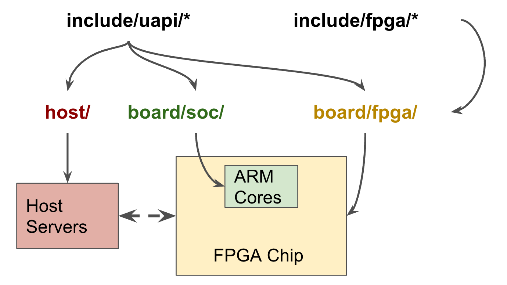
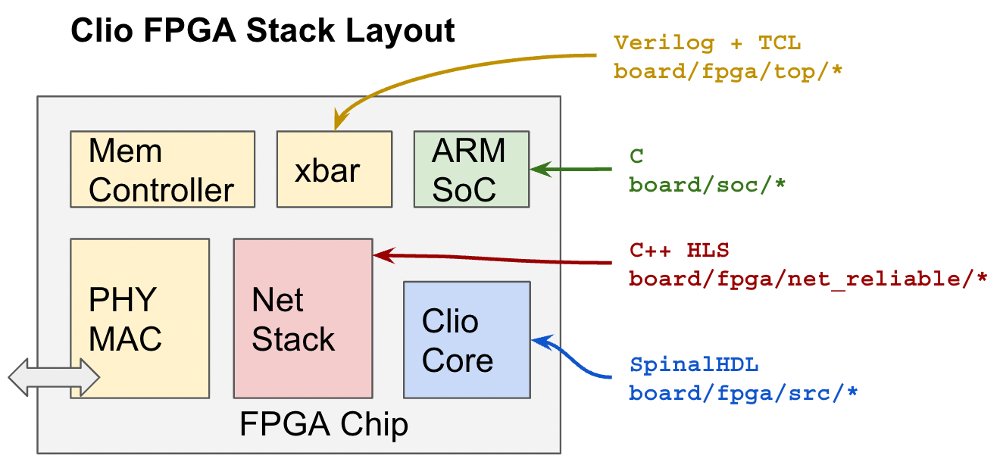
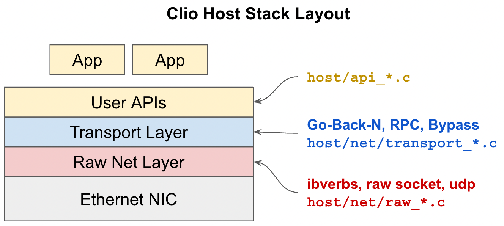
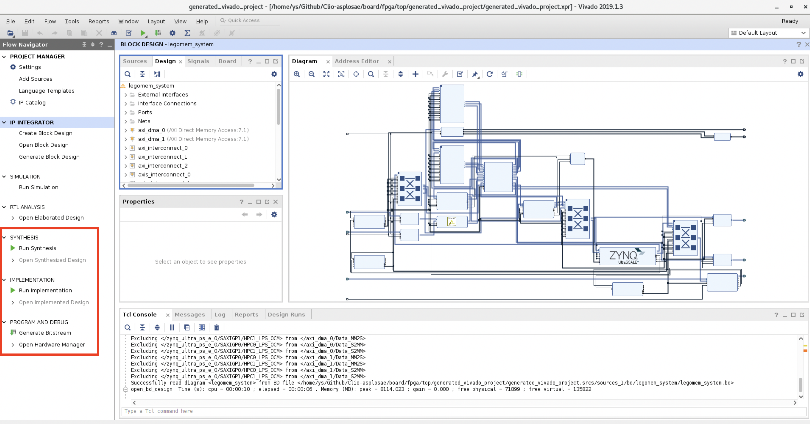

# Clio Compilation

This file documents the steps required to compile the Clio system.

Reminder that there are three major parts in Clio:
1. FPGA bitstream
2. ARM SoC code running inside FPGA board
3. Host side software

This following image shows the repo layout and hardware mapping at a high-level.



Zoom-in, the following image shows the FPGA side stack layout.



Finally, the host side stack layout.



FPGA compilation is the most time-consuming also the most complicated part. We need to first compile Scala into Verilog, then run Vivado scripts to compile design files into the final bitstream. The last two parts (SoC and Host) are just generic C code hence quick to compile.

Next, we will discuss each part in detail.

## Part 1: FPGA Bitstream

Software Prerequisite: **Vivado v2019.1.3 (64-bit)**, **Vivado HLS v2019.1.3 (64-bit)**, and **Scala**.
We use this version in our devlopment.
If you have to use other Vivado versions, the TCL scripts might fail due to mismatched
Vivado IP version numbers. To make it work, you have to update the TCL scripts
to using appropriate IP versions (simply specify the latest version). Nonetheless, we stronly recommend Vivado v2019.1 for compiling Clio. NOTE: to change Vivado PATH, see `board/fpga/Makefile.mk`.

Source code: FPGA related files are under `board/fpga/`.

The overall compilation flow is:
1. Go to `board/fpga/`. Run `make` directly. This step will compile Scala into Verilog, compile the HLS-based network work, and produce the top project. Please check the Makefile for more details
2. Go to `board/fpga/top/`. Run `make g` to open Vivado GUI.
3. Inside Vivado GUI, run Synthesis and Implementation to produce the bitstream.
4. Copy the produced the bitstream into an easy to access folder. **By default**, the bitstream can be found at `board/fpga/top/generated_vivado_project/generated_vivado_project.runs/impl_1/fpga.bit`.
Later on, we will use PetaLinux to load this bitstream into the FPGA board

Alternatively, you can also build Clio step by step:
```bash
# Compile SpinalHDL into RTL
make gen_rtl

# Package the generated RTL into Vivaod IP packages
make package_ip

# Compile HLS-based Network Stack into Vivado IP packages
make net

# Generate the top Vivado project consists of everything
make top

# (Use a GUI environment, e.g., VNC)
cd top && make g
```

Once you are in Vivado GUI, you could check out the Block Design for the complete design. To compile, click the Synthesis, Implementation,and Generate Bitstream options in the red box.



## Part 2: ARM SoC Code

Software Prerequisite: **aarch64 cross compilation software**.
This set of software usually comes with Vivado, hence you can run the following command to gain access to aarch64 compilers: `source /tools/Xilinx/Vivado/2019.1/settings64.sh` (change to your Vivado installation path).

Source code: `board/soc/core`.

Compilation is simple, go to `board/soc/core` and run `make` directly.
It produces an aarch64 binary named `core.o`. Later on, we will copy this
binary into the FPGA board. 

## Part 3: Host-Side Code

Software Prerequisite: **x86 compilation software, GCC version 8 and above**, **`libibverbs`**.
We used both CentOS 7 and Ubuntu 20.04 in our development. If you are in CentOS 7, try run `scl enable devtoolset-8 -- bash` to enable GCC 8.

Source coed: `host/`.

To compile, go to `host/` and run `make` directly.
It produces two binaries `host.o` and `monitor.o`.
We include all test files within these binaries.
To run Clio, we must have `host.o`. However, `monitor.o` is optional.
