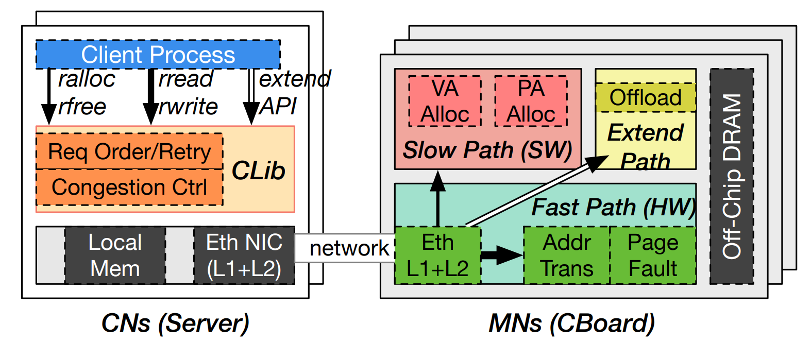

# Clio System

Clio is a disaggregated memory system that virtualizes,
protects, and manages disaggregated memory at hardware-based
memory nodes. More details in our ASPLOS'22 paper [here](https://arxiv.org/pdf/2108.03492.pdf).

This repo contains Clio's FPGA hardware design, host side software, and testing program.

## System Architetcure

The Clio hardware includes a new virtual memory
system, a customized network system, and a framework for computation offloading

## Documentation

Clio system has three major parts: the FPGA bitstream part, the ARM SoC part, and the host-side software.

To compile Clio, see [Documentation/compile.md](./Documentation/compile.md).

To run Clio, see [Documentation/run.md](./Documentation/run.md).

To debug Clio, see [Documentation/debug.md](./Documentation/debug.md).

**ASPLOS'22 Artifact Evaluators, please see [Documentation/asplos-ae.md](./Documentation/asplos-ae.md).**

## Repo Layout

High-level layout:

FPGA side stack layout:

Host side stack layout:

## License

MIT

## Disclaimer

This is a research prototype. Use at your own risk.

## Help

Please use [Github Issues](https://github.com/WukLab/Clio/issues).
