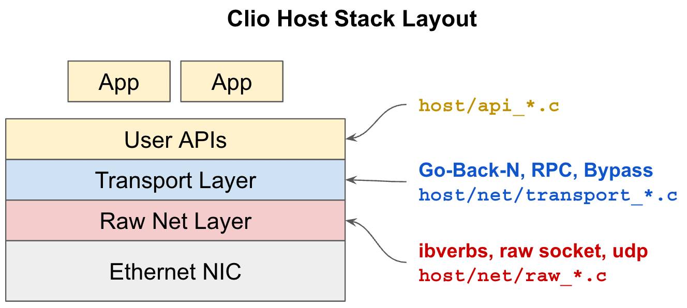

# Clio Artifact

Clio is a Hardware-Software Co-Designed Disaggregated Memory System.
The paper has been accepted to ASPLOS'22.
We are still working on the final version.
You can find a pre-publication version [here](https://arxiv.org/pdf/2108.03492.pdf).

**ASPLOS'22 Artifact Evaluators, please see [Documentation/asplos-ae.md](./Documentation/asplos-ae.md).**

## Documentation

Clio system has three major parts: the FPGA bitstream part, the ARM SoC part, and the host-side software.

To compile Clio, see [Documentation/compile.md](./Documentation/compile.md).

To run Clio, see [Documentation/run.md](./Documentation/run.md).

To debug Clio, see [Documentation/debug.md](./Documentation/debug.md).

## Repo Layout

High-level layout:

FPGA side stack layout:

Host side stack layout:

## Disclaimer

This is a research prototype. Use at your own risk.

## Authors

- Zhiyuan Guo
- Xuhao Luo
- Yutong Huang
- Yizhou Shan

## Help

Please use [Github Issues](https://github.com/WukLab/Clio/issues).
